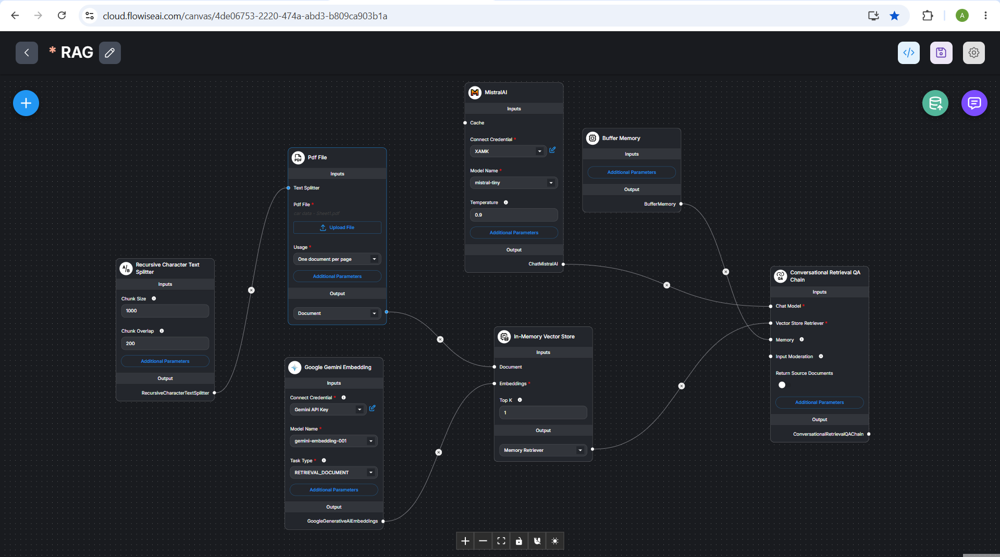

# 📊 ExcelMind RAG: Premium Excel Intelligence


**ExcelMind RAG** is a high-performance Retrieval-Augmented Generation application designed to transform static spreadsheets into interactive knowledge bases.

---

## 🚀 Setup Instructions

### 1. Prerequisites
- **Node.js**: v18+
- **Python**: v3.10+
- **Groq API Key**: Get it from the [Groq Console](https://console.groq.com/keys)

### 2. Backend Setup
1. Navigate to the backend folder:
   ```bash
   cd backend
   ```
2. Install dependencies:
   ```bash
   pip install -r requirements.txt
   ```
3. Create a `.env` file and add your Groq key:
   ```env
   GROQ_API_KEY=your_groq_api_key_here
   ```
4. Start the server:
   ```bash
   python main.py
   ```

### 3. Frontend Setup
1. Navigate to the frontend folder:
   ```bash
   cd frontend
   ```
2. Install dependencies:
   ```bash
   npm install
   ```
3. Start the dev server:
   ```bash
   npm run dev
   ```

---

## ✨ Features
- **Lightning Fast**: Powered by Groq Llama 3.3.
- **Excel Integration**: Processes `.xlsx` and `.xls` files into vector embeddings.
- **Semantic Search**: Uses FAISS for sub-millisecond retrieval.
- **Premium UI**: Modern dark-mode interface with glassmorphism.

---

## 🏗️ System Architecture



*The workflow above illustrates the RAG pipeline: from document ingestion and chunking to vector storage and conversational retrieval.*

---

## 🏗️ Project Structure

```text
├── backend/             # Python FastAPI server & RAG logic
│   ├── main.py
│   ├── requirements.txt
│   ├── architecture.png
│   └── .env             # Your API Key
├── frontend/            # Vite + Vanilla JS Frontend
│   ├── index.html
│   ├── style.css
│   ├── script.js
│   └── package.json
└── README.md
```
